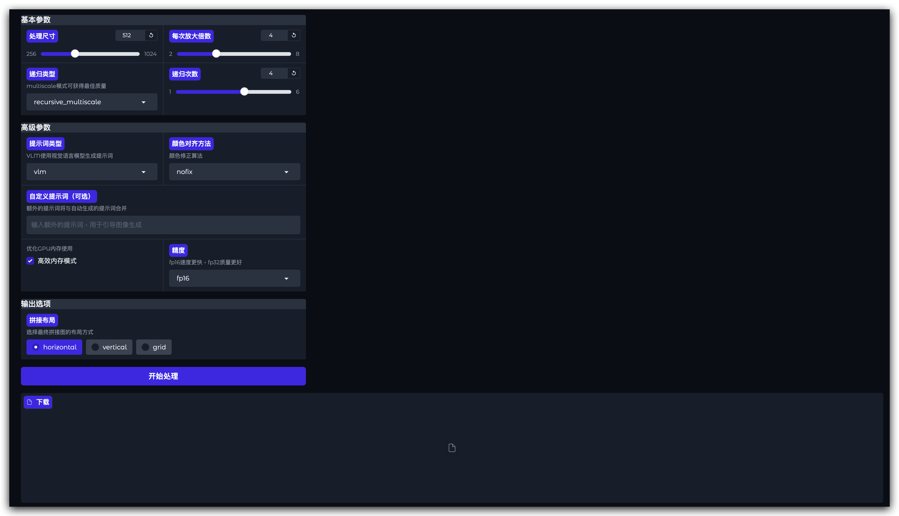

# Chain-of-Zoom: Extreme Super-Resolution via Scale Autoregression and Preference Alignment

本项目为 [Chain-of-Zoom: Extreme Super-Resolution via Scale Autoregression and Preference Alignment](https://arxiv.org/abs/2505.18600) 的官方实现。

## 🔥 项目简介

Chain-of-Zoom (CoZ) 是一种模型无关的极端超分辨率框架，通过多步递归放大和多尺度提示词引导，实现远超单步模型训练极限的高分辨率图像重建。每一步放大均可结合视觉语言模型（VLM）自动生成的多尺度提示词，进一步提升细节表现和人类偏好对齐。

## 主要特性

- 支持多种递归放大方式（多尺度、单尺度、插值等）
- 支持视觉语言模型（VLM）自动生成提示词
- 支持DAPE模型、手动自定义提示词
- 多种颜色对齐与修正算法
- 高效内存模式，适配大图和多步推理
- 直观易用的 Gradio Web UI

## 界面预览

### 参数设置界面


### 结果展示界面



---

## 环境准备

建议使用 Anaconda/Miniconda 管理环境。首先切换到项目专用环境：

```bash
source $(conda info --base)/etc/profile.d/conda.sh
conda activate coz
```

如未创建环境，请先创建（假设 Python 版本为 3.10，可根据实际需求调整）：

```bash
conda create -n coz python=3.10
conda activate coz
```

## 依赖安装

请先安装 requirements.txt 中的依赖：

```bash
pip install -r requirements.txt
```

> **注意：如果你的CUDA驱动为12.8，建议用官方源安装PyTorch相关包，以确保兼容性。可使用如下命令覆盖安装：**
>
> ```bash
> pip install torch torchvision torchaudio --index-url https://download.pytorch.org/whl/cu128
> ```

如需支持特定模型（如 Qwen2.5-VL、DAPE），请参考相关模型的官方文档安装依赖。

---

## 快速开始

### 1. 启动 Web UI

直接运行主程序 `gradio_coz.py` 即可启动 Web UI：

```bash
python gradio_coz.py
```

默认会在本地 `http://0.0.0.0:7860` 启动服务，可在浏览器访问。

#### Web UI 使用说明

1. 上传一张图像或使用示例图像
2. 调整参数（处理尺寸、放大倍数、递归次数等）
3. 点击"开始处理"按钮
4. 在结果标签页查看处理结果
5. 使用"下载完整拼接图"按钮保存结果

### 2. 命令行批量推理

可直接运行如下命令进行批量推理：

```bash
python inference_coz.py \
  -i samples \
  -o inference_results/coz_vlmprompt \
  --rec_type recursive_multiscale \
  --prompt_type vlm \
  --lora_path ckpt/SR_LoRA/model_20001.pkl \
  --vae_path ckpt/SR_VAE/vae_encoder_20001.pt \
  --pretrained_model_name_or_path 'stabilityai/stable-diffusion-3-medium-diffusers' \
  --ram_ft_path ckpt/DAPE/DAPE.pth \
  --ram_path ckpt/RAM/ram_swin_large_14m.pth
```

你也可以直接运行 `scripts/inference/` 下的 shell 脚本，例如：

```bash
bash scripts/inference/inference_coz_vlmprompt.sh
```

---

## 参数解释

- **处理尺寸**：输入图像的处理尺寸，更大的尺寸需要更多内存
- **每次放大倍数**：每步放大的倍数，通常为4倍
- **递归类型**：
  - `recursive_multiscale`：多尺度递归放大（最佳质量）
  - `recursive`：简单递归放大
  - `onestep`：一次性放大
  - `nearest`/`bicubic`：使用简单插值算法
- **递归次数**：执行放大的次数，更多次数可以放大更小的细节
- **提示词类型**：
  - `vlm`：使用视觉语言模型生成提示词（推荐）
  - `dape`：使用DAPE模型生成提示词
  - `null`：不使用提示词
- **颜色对齐**：对生成图像的颜色进行修正

---

## 预训练模型

| 模型 | 权重下载 |
|:---------|:--------|
| Stable Diffusion v3 | [Hugging Face](https://huggingface.co/stabilityai/stable-diffusion-3-medium)
| Qwen2.5-VL-3B-Instruct | [Hugging Face](https://huggingface.co/Qwen/Qwen2.5-VL-3B-Instruct)
| RAM | [Hugging Face](https://huggingface.co/spaces/xinyu1205/recognize-anything/blob/main/ram_swin_large_14m.pth)

---

## 高效内存模式

使用 `--efficient_memory` 选项可在单卡24GB显存下运行，但推理速度会变慢。建议多卡环境下使用以提升效率。

---

## 论文引用

如果本项目对你有帮助，请引用：

```
@article{kim2025chain,
  title={Chain-of-Zoom: Extreme Super-Resolution via Scale Autoregression and Preference Alignment},
  author={Kim, Bryan Sangwoo and Kim, Jeongsol and Ye, Jong Chul},
  journal={arXiv preprint arXiv:2505.18600},
  year={2025}
}
```

---

## 致谢

- [Gradio](https://gradio.app/)
- [Qwen2.5-VL](https://huggingface.co/Qwen/Qwen2.5-VL-3B-Instruct)
- 其他开源模型与工具

---

如有问题欢迎提 issue 或联系作者。

---

如需英文版或更详细的依赖说明，请告知！
